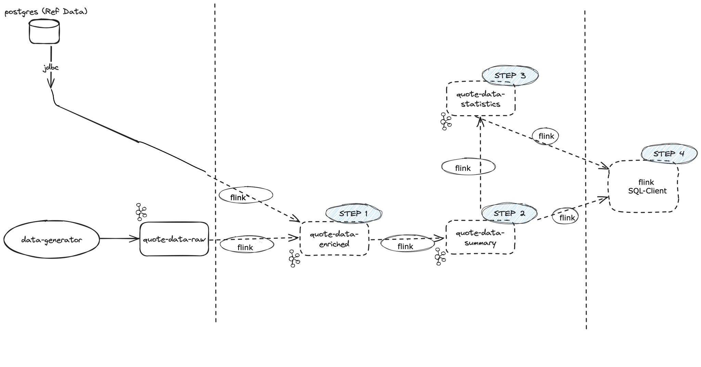

# Running the Practice environment
## Pre-reqs
Make sure to have Docker installed.
Make sure you're in the right directory (`flink-env`).

Before running docker-compose, we need to build two images:
```bash
docker build -t tooling -f tooling.Dockerfile .

docker build -t my-flink -f flink.Dockerfile .
```

## Running the environment
Simply run docker-compose for deploying the environment:
```bash
docker-compose -f env-compose.yml up -d
```

You can access Confluent Control Center at [localhost:9021](http://localhost:9021)

You can access Flink's JobManager at [localhost:8082](http://localhost:8082)

You can tear down your environment by running
```bash
docker-compose -f env-compose.yml down
```

## Environment Overview
This environment has been initially set up with data flowing into Kafka.


Reference data is present in a PostgreSQL database. There should be [50 symbols total](tooling/sql-data.sql). The [schema is available here](tooling/schema-postgresql-quote_data_symbols-value-v1.avsc).

Streaming Data is being sent through a simple Data Generator application, written into a `quote-data-raw` topic. Data is generated every 25~75ms. The [schema is available here](tooling/QuoteData.avsc).

You can access [Control Center](http://localhost:9021) to check topic data under port 9021.

## Lab

### Step 1: Enrich and clean dataset (Solution)
1. Go into the JobManager instance.
2. Submit the pyflink job.
```bash
flink run -p 1 -py quote-data-enrichment-sql.py -d &
```

The [solution is available here](tooling/quote-data-enrichment-sql.py)

The solution defines a Kafka source table 'raw_data_table', using a SQL Schema, that will consume from the 'quote-data-raw' topic with Avro Confluent format. Creates a JDBC table for PostgreSQL, using a SQL Schema. Defines a Kafka sink table 'enriched_table', using a SQL Schema, that will sink data into the 'quote-data-enriched' topic with Avro Confluent format. Executes an INSERT INTO query (representing a Flink job) to join and filter data from the source tables before inserting it into the enriched Kafka sink table.

### Step 2: Summary dataset (Solution)
1. Go into the JobManager instance.
2. Submit the pyflink job.
```bash
flink run -p 1 -py quote-data-summary-sql.py -d &
```

The [solution is available here](tooling/quote-data-summary-sql.py)

The solution defines a Kafka source table 'enriched_table', using a SQL Schema, that will consume from the 'quote-data-enriched' topic with Avro Confluent format. Defines a Kafka sink table 'summary_table', using a SQL Schema, that will sink data into the 'quote-data-summary' topic with Avro Confluent format. Executes an INSERT INTO query (representing a Flink job) to calculate and insert summarized data into the summary_table based on the data from the enriched_table.

### Step 3: Statistics dataset (Solution)
1. Go into the JobManager instance.
2. Submit the pyflink job.
```bash
flink run -p 1 -py quote-data-statistics-sql.py -d &
```

The [solution is available here](tooling/quote-data-statistics-sql.py)

The solution defines a Kafka source table 'summary_table', using a SQL Schema, that will consume from the 'quote-data-summary' topic with Avro Confluent format. Defines a Kafka sink table 'statistics_table', using a SQL Schema, that will sink data into the 'quote-data-statistics' topic with Avro Confluent format, and using the 'upsert-kafka' connector. Executes an INSERT INTO query (representing a Flink job) using a hoping window aggregation to insert/update data into the statistics_table.

### Step 4: Output/Visualise results (Solutions)
Solution 1:
1. Go into the JobManager instance.
2. Execute the Flink SQL-Client
```bash
./bin/sql-client.sh
```
3. Define a table 'summary_table' that will consume from the topic 'quote-data-summary'.
```sql
CREATE TABLE summary_table (
    `recordId` INT,
    `tobBid` DOUBLE,
    `tobAsk` DOUBLE,
    `uniqueBidProviders` ARRAY<INT>,
    `uniqueAskProviders` ARRAY<INT>,
    `sumAllBidSizes` INT,
    `sumAllAskSizes` INT,
    `processing_time` AS PROCTIME()
) WITH (
    'connector' = 'kafka',
    'topic' = 'quote-data-summary',
    'scan.startup.mode' = 'earliest-offset',
    'properties.bootstrap.servers' = 'kafka-1:9092,kafka-2:9092,kafka-3:9092',
    'format' = 'avro-confluent',
    'avro-confluent.url' = 'http://schema-registry:8081'
);
```
4. Execute a hoping window aggregation on the 'summary_table'.
```sql
SELECT
  recordId, 
  AVG(tobBid) AS avgTobBid, 
  AVG(tobAsk) AS avgTobAsk, 
  MAX(tobBid) AS maxTobBid,
  MIN(tobAsk) AS minTobAsk,
  MAX(sumAllBidSizes) AS maxSumBidAmount,
  MAX(sumAllAskSizes) AS maxSumAskAmount,
  MIN(sumAllBidSizes) AS minSumBidAmount,
  MIN(sumAllAskSizes) AS minSumAskAmount
FROM TABLE(
  HOP(TABLE summary_table, DESCRIPTOR(processing_time), INTERVAL '5' SECOND, INTERVAL '10' SECOND))
GROUP BY recordId;
```

Solution 2:
1. Go into the JobManager instance.
2. Execute the Flink SQL-Client
```bash
./bin/sql-client.sh
```
3. Define a table 'statistics_table' that will consume from the topic 'quote-data-statistics' using the 'upsert-kafka' connector.
```sql
CREATE TABLE statistics_table (
    `recordId` INT,
    `avgTobBid` DOUBLE,
    `avgTobAsk` DOUBLE,
    `maxTobBid` DOUBLE,
    `minTobAsk` DOUBLE,
    `maxSumBidAmount` INT,
    `maxSumAskAmount` INT,
    `minSumBidAmount` INT,
    `minSumAskAmount` INT,
    PRIMARY KEY (`recordId`) NOT ENFORCED
) WITH (
    'connector' = 'upsert-kafka',
    'topic' = 'quote-data-statistics',
    'properties.bootstrap.servers' = 'kafka-1:9092,kafka-2:9092,kafka-3:9092',
    'key.format' = 'avro-confluent',
    'key.avro-confluent.url' = 'http://schema-registry:8081',
    'value.format' = 'avro-confluent',
    'value.avro-confluent.url' = 'http://schema-registry:8081'
);
```
4. Make a SELECT on the 'statistics_table' to retrieve the topic data.
```sql
SELECT * FROM statistics_table;
```

# Notes
1. The solutions were developed with python and using a SQL API, however in the flink-quickstart-java is a Java example on how to create a simple Kafka source/sink and a JDBC connection to postgresDB.
2. In the file windowing-queries.sql are some examples of windowing functions.

# Troubleshooting
Q: Q
A: A
